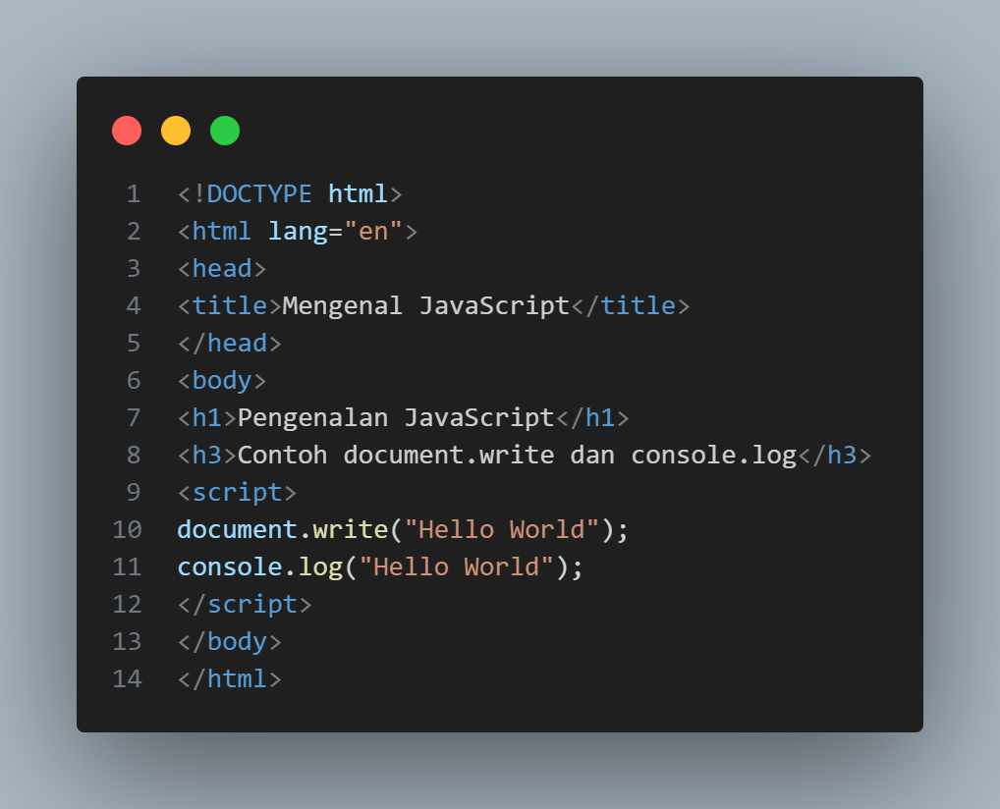

# Nama : Hendra Parsaulian
# Nim  : 312210689
# Kelas: T.I.22.A3

## Instruksi Praktikum
1. Persiapkan text editor misalnya VSCode.
2. Buat folder baru dengan nama ```lab5_javascript```.
3. Ikuti langkah-langkah praktikum yang akan dijelaskan berikutnya.
4. Lakukan validasi dokumen html dengan mengakses http://validator.w3.org
## Langkah-langkah Praktikum
* Persiapan membuat dokumen HTML dengan nama file ```lab5_javascript.html```seperti berikut.

* Output

## Javascript Dasar
* Pemakaian Alert sebagai property window.

* Output

* Pemakaian method dalam objek

* Output

* Pemakaian Prompt

* Output

* Pembuatan fungsi dan cara pemanggilannya

* Output


## Dasar Pemrograman Di Javascript
* Operasi dasar aritmatika

* Output


* Seleksi kondisi (if..else)

* Output


* Penggunaan operator switch untuk seleksi kondisi

* Output


## Pembuatan Form
* Form Input

* Output

* Form Button.

* Output


## HTML DOM
* Pilihan menggunakan checkBox dengan perhitungan otomatis

* Output

## Tugas
* Membuat script untuk melakukan validasi pada isian Form


* Output


